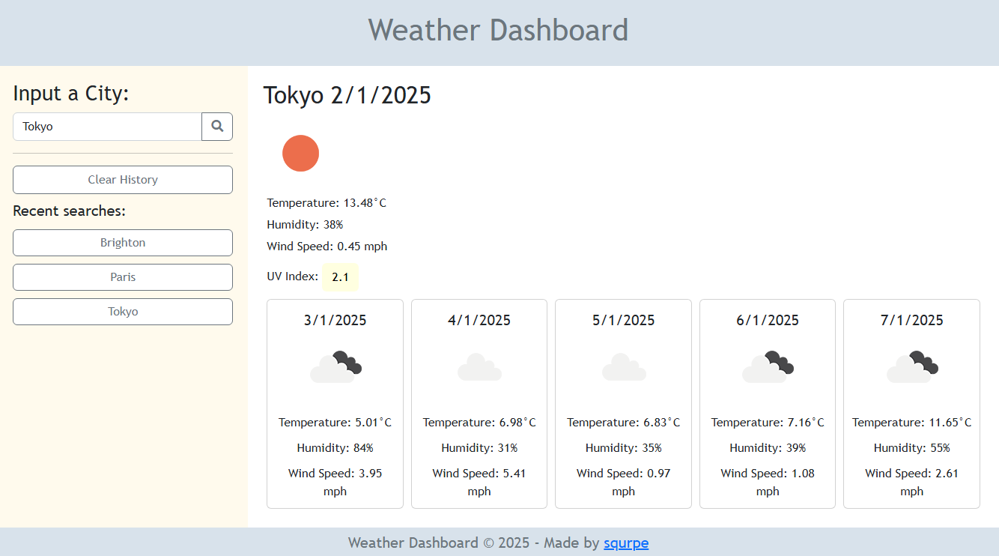

# Weather Dashboard

### Description

This application is a simple weather dashboard that allows one to view the current weather conditions and a 5-day forecast for a searched city. This project uses the [OpenWeather One Call API](https://openweathermap.org/api/one-call-api). Third-party APIs allow developers, like myself, to access their data and functionality by making requests with specific parameters to a URL.

## Table of Contents

- [Built With](#built-with)
- [Installation](#installation)
- [Usage](#usage)
- [Credits](#credits)
- [Contact](#contact)
- [License](#license)

## Built With

- HTML
- CSS
- Javascript ES6+

## Installation

Below is an example of how you can clone the project onto your own device:
1. Clone the repository within a new terminal
    ```md
        git clone https://github.com/squrpe/weatherdashboard.git
    ```

## Usage

To access the project's application follow this link https://squrpe.github.io/weatherdashboard/ or open within your chosen IDE or browser

Below is what the application looks like:



To use this application, the user types into the search box a city of your choice. Then, the user can view weather information for that city, up to 5 days ahead. They can also click on the previously searched buttons to view the same information the user previously searched for. If the user's search does not exist within the OpenWeather One Call API, it will still appear in the recent searches but nothing will update on the weather dashboard.

To reset the recent searches list, the user can press the 'Clear History' button on the left of the page.


## Credits

Base Code & Project Idea: The University of Adelaide Coding Bootcamp

## Contact

Lara Nicole - [grockelara@gmail.com](grockelara@gmail.com)

Project Link - https://github.com/squrpe/weatherdashboard

Project Deployment - https://squrpe.github.io/weatherdashboard/

## License

Distributed under the MIT License. See LICENSE.txt for more information.