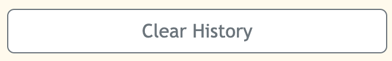

# Weather Dashboard

## Description

This application is a simple weather dashboard that allows one to view the current weather conditions as well as a 5-day forecast
for a searched city. This particular project uses the [OpenWeather One Call API](https://openweathermap.org/api/one-call-api). Third-party APIs allow developers, like myself, to access their data and functionality by making requests with specific parameters to a URL.


## Table of Contents

- [Installation](#installation)
- [Usage](#usage)

## Installation

Below is an example of how you can download the project onto your own device:

1. Open your devices terminal application
2. Locate to the correct file destination that you are wanting to download this project to
3. Clone the repository using this link: 
    ```md
        git clone https://github.com/squrpe/weatherdashboard.git
    ```
4. You may get prompted to input you github details, thus do so. Otherwise, the project will now be succesfully installed onto your device.

This project contains:
- HTML
- CSS
- Javascript

To open and access this project on your personal device, you can download an IDE of your choice but we recommend Visual Studio Code.

After downloading the IDE of your choice you will have access to the raw code. However to host the webpage locally, you will need to download an extension that allows you to open it into your default browser or in your IDE. I recommend Liveserver:


Then using this type of extension, right clicking the file and pressing "Open with Live Server" allows you to open the webpage in your default browser and check out the project from your own device.

## Usage

Below is what the application looks like:


To use this application, you must search into the search box a city of your choice. Then, you can view weather information for that city, up to 5 days ahead. You can also click on your previously searched buttons to view the same information you had already looked at. 

If you want to reset your searches, you can press the 'Clear History' button on the left of the page.



---

## Contact

Lara Grocke - [@my_twitter](twitter.com) - [myemail@email.com](gmail.com)

Project Link - https://github.com/squrpe/weatherdashboard

Project Deployment - https://squrpe.github.io/weatherdashboard/